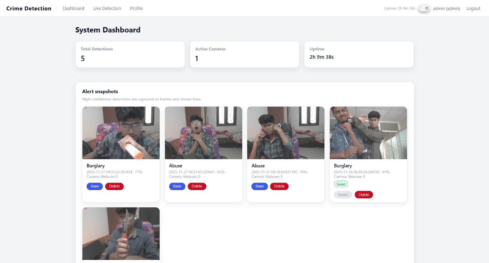

# Crime Detection System (Flask + VideoMAE)

[](https://www.python.org/downloads/)
[](https://flask.palletsprojects.com/)
[](#license)

A **real-time crime classification system** powered by **VideoMAE** (Video Masked Autoencoders) in PyTorch, served through a modern **Flask** web app. Features asynchronous camera streaming, intelligent alert deduplication, snapshot logging, and instant **email notifications via Resend**.


*Real-time detection with overlay + alert card & email notification*

---

## Features

* **Real-Time Video Crime Detection**
    Async capture + async inference pipeline · Smooth MJPEG streaming · Overlayed predictions · Stability logic to avoid false positives.
* **Alert Snapshot Logging**
    Auto-captures frame on crime detection · Saves to `static/detections/` · Glossy alert cards on dashboard · Save / Delete actions.
* **Email Alerts via Resend**
    Instant beautiful emails · Uses resend.dev (free tier friendly) · Only sends to verified emails unless domain verified.
* **Modern UI + Dark/Light Mode**
    Full theme toggle · Glassmorphism cards · Fully responsive.
* **User Accounts & Roles**
    Login / Register / Logout · Admin & Viewer roles · Profile page · Session uptime tracking.

---

## Screenshots

| Dashboard (Light) | Live Feed + Alert (Dark) | Email Alert Example |
| :--- | :--- | :--- |
|  |  |  |

*(Create a `screenshots/` folder and add your images there)*

---

## Project Structure

```text
crime-detection-flask/
├── app/
│   ├── auth/                     # Login, logout, register
│   ├── dashboard/                # Dashboard + snapshot UI
│   ├── detection/                # Live feed + stats endpoints
│   ├── services/
│   │   ├── camera_manager.py     # Async video pipeline
│   │   └── model_inference.py    # VideoMAE wrapper
│   ├── static/
│   │   ├── css/main.css
│   │   ├── js/live.js
│   │   └── detections/           # Saved snapshots
│   ├── templates/
│   │   ├── base.html, login.html, register.html
│   │   ├── dashboard.html, profile.html, live.html
│   ├── models.py
│   ├── extensions.py
│   ├── config.py
│   └── __init__.py
├── migrations/                   # Flask-Migrate
├── screenshots/                  # Demo images & GIFs
├── models/VideoMAE.pth           # Pre-trained model
├── requirements.txt
├── run.py
├── .env.example
├── install.sh                    # One-click installer
└── README.md                     # This file


## Installation

### Option 1: One-Click Install Script (Recommended)

```bash
curl -fsSL [https://raw.githubusercontent.com/uzayr-iqbal-hamid/crime-detection-flask/main/install.sh](https://raw.githubusercontent.com/uzayr-iqbal-hamid/crime-detection-flask/main/install.sh) | bash
```

### Option 2: Manual Setup

1. Clone and Setup Env

```bash
git clone [https://github.com/uzayr-iqbal-hamid/crime-detection-flask.git](https://github.com/uzayr-iqbal-hamid/crime-detection-flask.git)
cd crime-detection-flask

# Create virtual environment
python -m venv venv
source venv/bin/activate        # Windows: venv\Scripts\activate

# Install dependencies
pip install -r requirements.txt
```

2. Configure Environment Variables

Copy the example and edit:

```bash
cp .env.example .env
```

Edit your .env file:

```bash
FLASK_ENV=development
SECRET_KEY=change-this-in-production-please

# Database
SQLALCHEMY_DATABASE_URI=sqlite:///app.db

# Model path
CRIME_MODEL_PATH=models/VideoMAE.pth

# Resend Email
RESEND_API_KEY=re_XXXXXXXXXXXXXXXXXXXXXXXX
ALERT_EMAIL_FROM=CrimeDetection@resend.dev
ALERT_EMAIL_TO=your-personal-email@gmail.com

# Required for absolute URLs in emails
SERVER_NAME=localhost:5000
PREFERRED_URL_SCHEME=http
```

3. Initialize Database

```bash
flask db init
flask db migrate -m "Initial migration"
flask db upgrade

# Create first admin user
flask shell
>>> from app.models import User, db
>>> u = User(username="admin", email="admin@example.com", role="admin")
>>> u.set_password("admin123")
>>> db.session.add(u)
>>> db.session.commit()
>>> exit()
```

4. Run the App

```bash
flask run
```

- Open: http://localhost:5000
- Default Login: admin / admin123

## How It Works

Async Triple-Thread Architecture

```plaintext
Webcam → [Capture Thread] → Frame Queue → [Inference Thread (VideoMAE)] → Result Queue → [MJPEG Stream] → Browser
```

<i>Keeps 60 FPS streaming even when inference takes 300–800ms.</i>

<strong>Smart Alert Logic (No Spam!)</strong>

Triggers only when:
- Crime label detected.
- Confidence ≥ 0.75.
- Same label repeated N times (default: 1).
- Last alert > 8 seconds ago.

<i>Then:</i> saves snapshot + logs to DB + sends email.

## Known Issues & Limitations

| Issue                          | Status       | Workaround / Plan                                      |
|--------------------------------|--------------|--------------------------------------------------------|
| High CPU/GPU usage             | Known        | Use lighter model (e.g., MobileViT, EfficientNet) in future |
| Resend free tier restrictions  | Limitation   | Only sends to verified emails — verify your domain or use personal email |
| Single camera only             | Planned      | Multi-camera & RTSP support coming soon                |
| No mobile app yet              | Planned      | React Native / Flutter version in roadmap              |
| OS Compatibility               | Tested       | Fully works on macOS & Windows · Raspberry Pi untested |

## Developer Onboarding

Quick Start

```bash
# Quick start for new devs
git clone [https://github.com/your-username/crime-detection-flask.git](https://github.com/your-username/crime-detection-flask.git)
cd crime-detection-flask
./install.sh          # or: curl ... | bash
flask run
```

Useful Commands
```bash
# Format code
black .

# Recreate migrations
flask db migrate -m "describe change"
flask db upgrade

# Delete all detections (keep users)
flask shell
>>> from app.models import Detection, db
>>> Detection.query.delete(); db.session.commit()

# Clear old snapshots manually
rm -rf app/static/detections/*
```

Branching Strategy
```bash
git checkout main && git pull
git checkout -b feature/your-feature-name

# ... work ...

git commit -m "feat: add sound-based violence detection"
git push -u origin feature/your-feature-name
```

Cleaning Old Snapshots
```bash
# Remove all snapshots (safe)
rm -rf app/static/detections/*

# Remove snapshots older than 7 days
find app/static/detections/ -mtime +7 -delete
```

## License

This project is private and intended for internal/team use only. Not licensed for public redistribution unless explicitly authorized.

## Contributing

Contributions are welcome!
1. Fork or create a branch: feature/your-awesome-idea
2. Commit with clear messages.
3. Open a Pull Request with screenshots/GIF if possible.

Made with passion for safer communities. Enjoy responsibly!